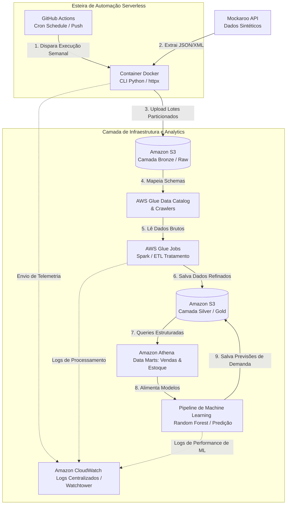

# FoodWaste — Monitoramento e Prevenção de Desperdício Alimentar

O **FoodWaste** é uma solução de inteligência de dados ponta-a-ponta projetada para enfrentar o desafio do desperdício de alimentos em ambientes comerciais e de varejo. O projeto realiza a ingestão de dados de vendas de forma autônoma para identificar padrões de consumo, prever sobras via Machine Learning e gerar recomendações operacionais de alto impacto.

Esta arquitetura foi projetada para operar de forma **100% automatizada**, simulando um ambiente real de produção com um histórico de **3 meses** de dados sintéticos de alta fidelidade.

---

## 🧩 Necessidades e Objetivos

* **Aperfeiçoamento Profissional:** Consolidação de conhecimentos avançados em **Engenharia de Dados** e **MLOps**, integrando Python, AWS (S3, Glue, Athena, CloudWatch), Docker e pipelines de CI/CD via GitHub Actions.
* **Sustentabilidade (ESG):** Redução do desperdício alimentar por meio de previsões de demanda precisas, otimizando estoques e compras de insumos.
* **Eficiência Financeira e Administrativa:** Geração de insights e relatórios com base em dados de vendas e estoque para tomadas de decisão que minimizam custos operacionais e aumentam a rentabilidade.

---

## 📌 Sumário

1. [Diagrama da Arquitetura](#-diagrama-da-arquitetura)
2. [Processo de Ingestão e Automação](#-processo-de-ingestão-e-automação)
   * [Ingestão de Vendas (XML)](#ingestão-de-vendas-xml)
   * [Ingestão de Estoque de Ingredientes (JSON)](#ingestão-de-estoque-de-ingredientes-json)
3. [Estrutura do Data Lake (S3)](#-estrutura-do-data-lake-s3)
4. [Processamento e Refino (AWS Glue)](#-processamento-e-refino-aws-glue)
5. [Data Marts e Machine Learning](#-data-marts-e-machine-learning)
6. [Automação e CI/CD (GitHub Actions)](#-automação-e-cicd-github-actions)
   * [Gatilho por Código (CI)](#1-gatilho-por-código-ci)
   * [Gatilho por Tempo (Cron/Schedule)](#2-gatilho-por-tempo-cronschedule)
   * [Segurança com GitHub Secrets](#3-segurança-com-github-secrets)
7. [Observabilidade e Logs (CloudWatch)](#-observabilidade-e-logs-cloudwatch)
8. [Como Executar Localmente](#-como-executar-localmente)

---

## 📐 Diagrama da Arquitetura

Aqui está o fluxo lógico da solução, desde a geração do dado até a predição final:



## ⚙️ Processo de Ingestão e Automação

O pipeline de dados inicia com a geração de dados sintéticos estruturados que mimetizam perfeitamente o cenário de um restaurante:

### Ingestão de Vendas (XML)
* **Fonte de Dados:** Integração com a API do **Mockaroo** para gerar datasets de vendas dinâmicos (variando entre 500 e 1000 registros por lote).
* **Formato de Carga:** Os dados são capturados via `httpx`, convertidos estruturalmente para o formato **XML** através da biblioteca `dicttoxml` (encapsulados sob a tag raiz `<vendas>`) e salvos no S3 de forma particionada por data.

### Ingestão de Estoque de Ingredientes (JSON)
* **Fonte de Dados:** Consumo do endpoint de insumos para refletir o status atual do estoque da cozinha.
* **Formato de Carga:** Os dados são extraídos, tratados e carregados em formato raw **JSON**, permitindo o rastreamento minucioso do volume de insumos disponíveis.

### Flexibilidade de Execução (Dual Mode)
O script `ingestaoapi.py` foi projetado com uma trava arquitetural (`if __name__ == "__main__":`). Isso permite que ele opere em dois modos:
1. **Modo Web (FastAPI):** Expõe endpoints assíncronos (`BackgroundTasks`) documentados via Swagger para testes manuais e integração de microsserviços locais.
2. **Modo CLI (Script Direto):** Permite a execução em lote (*batch*) disparada por orquestradores externos sem a necessidade de manter um servidor web ocioso em execução.

---

## 🗄️ Estrutura do Data Lake (S3)

Os dados são organizados no Amazon S3 seguindo o padrão de arquitetura medalhão de forma particionada por tempo (`ano/mes/dia`), otimizando o custo de varredura de futuras queries no AWS Athena:

```text
seu-bucket-s3/
├── bronze/
│   ├── vendas_semanais/
│   │   └── ano=YYYY/
│   │       └── mes=MM/
│   │           └── dia=DD/
│   │               └── vendas_HH-MM-SS.xml
│   └── estoque_ingredientes/
│       └── ano=YYYY/
│           └── mes=MM/
│               └── dia=DD/
│                   └── ingredientes_HH-MM-SS.json
└── static/
    └── menu/
        └── pratos_produtos.csv
